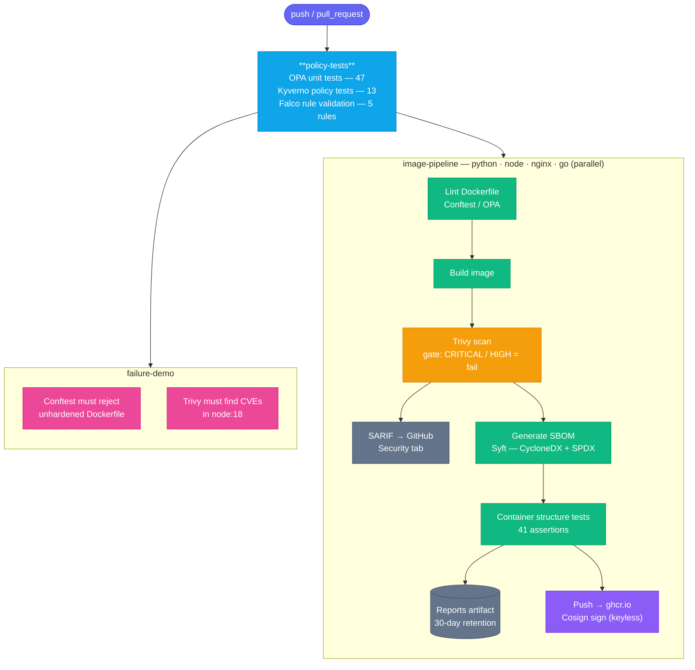

# Container Hardening Lab

[](https://github.com/R055LE/container-hardening-lab/actions/workflows/container-security.yml)

A portfolio project demonstrating production-grade container hardening, vulnerability scanning, and policy-as-code enforcement — aligned with the [CIS Docker Benchmark](https://www.cisecurity.org/benchmark/docker) and [DoD Iron Bank](https://ironbank.dso.mil/) practices.

## What This Demonstrates

This lab addresses the most common container security failures in production:

- **Containers running as root** — every image in this repo runs as a non-root user (UID 10001 on the Debian-based images, 65532 on the distroless ones)
- **Bloated attack surface** — multi-stage builds strip build tooling; `wget`, `curl`, `perl`, SUID/SGID binaries are explicitly removed; the Go image uses distroless (no shell, no package manager, no libc)
- **Unpinned or untrusted base images** — an OPA allowlist enforces approved registries and warns on unpinned digests
- **No admission control** — Kyverno ClusterPolicies block privileged pods, host namespace sharing, and missing capability drops at deploy time
- **No evidence trail** — every image ships a CycloneDX + SPDX SBOM and a Trivy CVE report; findings gate the CI build
- **Unsigned images** — every image pushed to ghcr.io is signed with Cosign (keyless, via Sigstore); a Kyverno `verifyImages` policy rejects unsigned images at admission
- **No runtime visibility** — Falco custom rules detect post-exploitation behavior (shell spawned, package manager executed, outbound C2 connection) inside the hardened containers

## Repository Structure

```
.
├── images/
│   ├── python/               # distroless python3-debian13 — reference hardened image
│   ├── node/                 # distroless nodejs24-debian13 — Express API
│   ├── nginx/                # nginx:1.27-alpine — static file server
│   └── go/                   # distroless — statically compiled Go binary
│
├── policies/
│   ├── opa/                  # Rego policies evaluated by Conftest against Dockerfiles
│   │   ├── no-root.rego
│   │   ├── no-privileged.rego
│   │   └── image-source-allowlist.rego
│   └── kyverno/              # Kubernetes admission policies
│       ├── no-root.yaml
│       ├── no-privileged.yaml
│       └── image-source-allowlist.yaml
│
├── tests/
│   ├── opa/                  # OPA unit tests (opa test)
│   ├── kyverno/              # Kyverno CLI policy tests + fixture Pods
│   └── structure/            # Container structure tests (runtime assertions)
│
├── examples/
│   └── unhardened/           # Deliberately insecure Dockerfile — failure demo
│
├── falco/
│   ├── rules/                # Custom Falco runtime detection rules
│   └── docker-compose.yml    # Local Falco demo setup
│
├── .github/workflows/container-security.yml  # Full CI pipeline
└── Makefile                  # Primary task interface
```

## Hardening Controls

All images apply the following controls, mapped to CIS Docker Benchmark sections:

| CIS Control | What It Does | Implementation |
|---|---|---|
| **4.1** Non-root user | Prevent privilege escalation if container is compromised | `nonroot` (65532) on distroless python/node; `appuser`/`nginx` (10001/101) elsewhere; `USER` set before `CMD` |
| **4.2** Trusted base images | Prevent supply-chain compromise via malicious base images | OPA allowlist policy; only official Docker Hub, GCR Distroless, Chainguard, Iron Bank, ECR permitted |
| **4.4** Multi-stage builds | Strip build tooling from the final image | Builder stage installs deps; final stage copies only artifacts |
| **4.7** Remove unnecessary packages | Reduce attack surface | `wget`, `curl`, `perl`, `gcc`, `binutils` removed; BusyBox applets removed by binary path |
| **4.8** No SUID/SGID bits | Prevent privilege escalation via setuid binaries | `find / -xdev -perm /4000 -o -perm /2000 -exec chmod ug-s` run at build time |
| **4.9** No secrets in image | Prevent credential leakage via image inspection | No `ENV` with credentials; runtime-injected secrets only |
| **5.2/5.3** No host namespaces | Prevent container escape via host PID/IPC/network | Kyverno policy blocks `hostPID`, `hostIPC`, `hostNetwork: true` |
| **5.4** No privileged containers | Prevent full host access | Kyverno policy blocks `privileged: true`, requires `allowPrivilegeEscalation: false`, requires `capabilities.drop: ALL` |
| **5.7** Unprivileged ports | Avoid requiring `CAP_NET_BIND_SERVICE` | All images expose ports ≥ 1024 (8000, 3000, 8080) |

## Test Layers

The test suite has four independent layers, each catching a different class of failure:

### 1. OPA Unit Tests — policy logic

Tests the Rego policy rules themselves using `opa test`, without needing Docker. Fast feedback on policy correctness.

```bash
make test-opa
```

47 tests across three policies:

| Policy | Tests | What It Verifies |
|---|---|---|
| `no-root.rego` | 13 | Detects missing `USER`, `USER root`, `USER 0`, `USER 0:group` |
| `no-privileged.rego` | 14 | Detects `RUN --privileged`, warns on ports < 1024 and `--chown=root` |
| `image-source-allowlist.rego` | 20 | Approves/denies registries, warns on unpinned digests, covers multi-stage |

### 2. Kyverno Policy Tests — admission control

Tests Kyverno `ClusterPolicy` rules against fixture Pod manifests using `kyverno test`. No cluster required.

```bash
make test-kyverno
```

13 tests covering pass and fail cases for each rule:

| Test | Fixture | Expected |
|---|---|---|
| Non-root user required | `pod-fail-runasroot.yaml` | Deny |
| `runAsNonRoot: false` blocked | `pod-fail-runasnonroot-false.yaml` | Deny |
| `allowPrivilegeEscalation` blocked | `pod-fail-privilege-escalation.yaml` | Deny |
| `privileged: true` blocked | `pod-fail-privileged.yaml` | Deny |
| `capabilities.drop: ALL` required | `pod-fail-no-caps-drop.yaml` | Deny |
| `hostPID/hostIPC/hostNetwork` blocked | 3 fixture files | Deny |
| Fully hardened pod | `pod-pass-hardened.yaml` | Pass |

### 3. Falco Rule Validation — runtime detection rules

Validates that the custom Falco rules load without errors — syntax, macro/list resolution, and field references are all checked. Uses the Falco container so no kernel access is needed.

```bash
make test-falco
```

Validates all 5 custom rules in `falco/rules/container-hardening-lab.yaml` against Falco's rule engine. Catches YAML parse errors, invalid condition syntax, undefined macros/lists, and unrecognised field names.

### 4. Container Structure Tests — runtime assertions

Tests the actual built image at runtime using `container-structure-test`. These catch regressions that only manifest after the image is built — e.g., a package manager silently re-adding a SUID binary.

```bash
make test-structure IMAGE=python   # or node, nginx, go
```

53 tests across four images:

| Image | Tests | Checks |
|---|---|---|
| `hardened-python` | 16 | UID 65532, no shell, no pip/apt, `/app` workdir, PYTHONPATH on sys.path, nologin shell, OCI labels. SUID/SGID checked by `scripts/check-suid.sh` |
| `hardened-node` | 16 | UID 65532, no shell, no npm, Express importable, `src/index.js` present, OCI labels. SUID/SGID checked by `scripts/check-suid.sh` |
| `hardened-nginx` | 13 | UID 101, no SUID/SGID, no wget/curl, `server_tokens off`, port 8080, security headers, OCI labels |
| `hardened-go` | 12 | UID 65532, no shell/bash, no wget/curl/apt/apk/gcc/go, CA certs present, OCI labels (distroless) |

## Failure Demo

`examples/unhardened/Dockerfile` is deliberately insecure. The CI pipeline asserts that the OPA linter and Trivy scanner **must** flag it — a clean result would mean the tooling isn't working.

Violations the Conftest policies catch:

```
FAIL - examples/unhardened/Dockerfile - docker.security - CIS 4.1: No USER instruction found.
WARN - examples/unhardened/Dockerfile - docker.security - CIS 5.7: EXPOSE 80 uses a privileged port.
WARN - examples/unhardened/Dockerfile - docker.security - Files COPY'd with --chown=root will not be writable by the app user.
WARN - examples/unhardened/Dockerfile - docker.security - Image 'node:18' is not pinned to a digest.
```

Trivy separately flags `node:18` as carrying CRITICAL/HIGH CVEs (the image is intentionally pinned to an old, vulnerable release).

Negative structure tests (`tests/structure/unhardened.yaml`) then build the image and assert it **has** the problems the hardened images eliminate — running as root (UID 0), SUID binaries present, wget/curl/perl/apt-get all installed. This makes the before/after contrast concrete and testable.

## Prerequisites

| Tool | Version | Install |
|---|---|---|
| Docker | ≥ 24 | [docs.docker.com](https://docs.docker.com/get-docker/) |
| Trivy | ≥ 0.69 | [aquasecurity.github.io/trivy](https://aquasecurity.github.io/trivy/latest/getting-started/installation/) |
| Syft | ≥ 1.0 | [github.com/anchore/syft](https://github.com/anchore/syft#installation) |
| Conftest | ≥ 0.57 | [conftest.dev](https://www.conftest.dev/install/) |
| OPA | ≥ 0.70 | [openpolicyagent.org](https://www.openpolicyagent.org/docs/latest/#1-download-opa) |
| Kyverno CLI | ≥ 1.17 | [kyverno.io/docs/kyverno-cli](https://kyverno.io/docs/kyverno-cli/) |
| container-structure-test | ≥ 1.19 | [github.com/GoogleContainerTools/container-structure-test](https://github.com/GoogleContainerTools/container-structure-test#installation) |

## Quick Start

```bash
# Run policy tests only — no Docker required, fast feedback
make test

# Run all tests including Falco rule validation (requires Docker)
make test-all

# Build, scan, and generate SBOMs for all images
make all

# Run container structure tests (images must be built first)
make test-structure IMAGE=python
make test-structure IMAGE=node
make test-structure IMAGE=nginx
make test-structure IMAGE=go

# Individual targets for a single image
make build IMAGE=python
make scan  IMAGE=python
make sbom  IMAGE=python
make lint  IMAGE=python
```

Scan reports and SBOMs are written to `reports/<image>/`:

```
reports/python/
├── trivy.json              # CVE scan results (JSON)
├── sbom.cyclonedx.json     # Software Bill of Materials (CycloneDX)
└── sbom.spdx.json          # Software Bill of Materials (SPDX)
```

## CI Pipeline

The GitHub Actions workflow (`.github/workflows/container-security.yml`) runs three jobs on every push and pull request:



**`policy-tests`** runs first — fast feedback on every push. OPA and Kyverno tests need no Docker; Falco validation uses the Falco container image to validate rule syntax and field references.

**`failure-demo`** asserts that the unhardened Dockerfile and `node:18` base image are correctly flagged. A clean result here fails the job, proving the tooling is live.

**`image-pipeline`** runs in parallel across all three images. Trivy findings are uploaded to the GitHub Security tab as SARIF for triage. All reports are archived as build artifacts for 30 days.

## Image Signing

Every image pushed to `ghcr.io` by the CI pipeline is signed with [Cosign](https://github.com/sigstore/cosign) using keyless signing via [Sigstore](https://sigstore.dev/). No private key is stored anywhere — the signature is tied to the GitHub Actions OIDC identity of the workflow.

Verify a signed image (no key required):

```bash
cosign verify \
  --certificate-identity-regexp \
    "https://github.com/R055LE/container-hardening-lab/.github/workflows/container-security.yml@refs/heads/main" \
  --certificate-oidc-issuer "https://token.actions.githubusercontent.com" \
  ghcr.io/r055le/container-hardening-lab-python:latest
```

A successful verification confirms the image was built and pushed by this CI workflow from the `main` branch — not pushed manually or from a compromised pipeline. The `policies/kyverno/verify-signatures.yaml` ClusterPolicy enforces this at admission time, rejecting any Pod that references an unsigned image from this registry.

## Runtime Security

`falco/` adds a runtime detection layer using [Falco](https://falco.org/) (CNCF graduated). Where the build-time and deploy-time controls reduce the attack surface, Falco detects exploitation attempts that occur after a container is running.

Five custom rules cover the post-exploitation kill chain:

| Rule | What It Catches |
|---|---|
| Shell spawned | Interactive shell started inside a hardened container |
| Package manager | `apt`, `pip`, `npm`, `apk` used to install attack tools |
| Sensitive file read | `/etc/shadow`, SSH keys, sudoers files opened |
| Unexpected outbound | Container initiating TCP to an external address (C2/exfil) |
| Filesystem write | Write to a non-temp path (persistence attempt) |

Run the demo locally with Docker Compose — see [falco/README.md](falco/README.md) for the walkthrough.

## Deployment (Kubernetes)

To enforce the admission policies on a cluster:

```bash
# Apply Kyverno ClusterPolicies
kubectl apply -f policies/kyverno/

# Verify — this Pod should be blocked
kubectl apply -f tests/kyverno/resources/pod-fail-privileged.yaml
```

The policies are written in audit mode by default (`validationFailureAction: Audit`). Change to `Enforce` in production.
